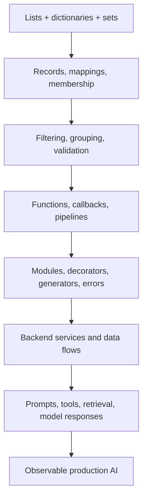

# Python: From First Principles to AI Engineering

> A living learning lab for building Python intuition one small system at a time.

This repository follows a practical path from Python fundamentals to backend engineering, machine learning, and AI/LLM systems. The goal is not to collect disconnected tutorials. It is to see how a small idea grows:

```text
syntax -> pattern -> abstraction -> software system -> AI capability
```

## The Journey Dashboard

**Current checkpoint:** `Python foundations + mental-bridge applications`

```text
Python foundations   [##########] 100%   strings, data structures, control flow, functions
Pythonic thinking    [##########] 100%   comprehensions, modules, iterators, reusable patterns
Object-oriented code [########--]  80%   classes, inheritance, methods, properties
Small applications   [##########] 100%   10 scenario-driven programming modules
Backend engineering  [##--------]  20%   patterns are being connected now
ML fundamentals      [----------]   0%   next learning frontier
LLM / RAG / agents   [----------]   0%   future systems layer
Production AI        [----------]   0%   testing, observability, deployment
```

### How to update it

When a new milestone is completed, update the bars and the checkpoint above. The dashboard is intentionally simple: it is a visible progress signal, not a claim of mastery.

## Learning Map

```mermaid
flowchart LR
    A[Python basics] --> B[Data structures]
    B --> C[Control flow]
    C --> D[Functions and composition]
    D --> E[Modules and error handling]
    E --> F[OOP and abstraction]
    F --> G[Data processing]
    G --> H[Backend patterns]
    H --> I[Databases and async]
    I --> J[ML foundations]
    J --> K[LLM applications]
    K --> L[RAG and agents]
    L --> M[Production AI]

    classDef current fill:#d9f99d,stroke:#365314,color:#1a2e05,stroke-width:2px;
    classDef future fill:#e0f2fe,stroke:#075985,color:#082f49;
    class F,G current;
    class H,I,J,K,L,M future;
```



## What Is Here

### Core Python

| Stage | What it contains |
| --- | --- |
| Fundamentals | Strings, numbers, lists, sets, tuples, dictionaries, conditions, loops, and iterators |
| Reusable code | Functions, arguments, comprehensions, modules, imports, and standard-library exploration |
| Object-oriented Python | Classes, class variables, class/static methods, inheritance, special methods, and properties |
| Mental models | Notes that connect everyday Python operations to backend and AI systems |

### Small Mental-Bridge Applications

Each application begins with a realistic scenario and connects a few familiar Python ideas to a larger engineering pattern.

| Module | Python idea | System connection |
| --- | --- | --- |
| [01 - Zip and dictionary mapping](Python_Application/01_zip_dictionary_mapping.py) | `zip`, dictionaries, filtering | Authorization and tool access |
| [02 - Set permissions](Python_Application/02_set_permissions.py) | Sets and membership | Permission checks |
| [03 - Filter users](Python_Application/03_filter_users.py) | Functions and filtering | Query-like selection |
| [04 - Transform API data](Python_Application/04_transform_api_data.py) | Mapping and transformation | API response shaping |
| [05 - Group users by role](Python_Application/05_group_users_by_role.py) | Grouping and dictionaries | Aggregation and reporting |
| [06 - JSON data processing](Python_Application/06_json_data_processing.py) | JSON and records | External data boundaries |
| [07 - Function as data](Python_Application/07_function_as_data.py) | Callbacks and strategies | Pluggable behavior |
| [08 - Decorator logging](Python_Application/08_decorator_logging.py) | Decorators | Observability and tracing |
| [09 - Generator data](Python_Application/09_generator_large_data.py) | Generators | Streaming and memory efficiency |
| [10 - Error-handling pipeline](Python_Application/10_error_handling_pipeline.py) | Exceptions and pipelines | Resilient processing |

## The Core Mental Model



The syntax stays familiar while the surrounding system becomes more disciplined:

- A dictionary mapping becomes authorization.
- A filter becomes metadata retrieval.
- A generator becomes streaming.
- A decorator becomes logging or tracing.
- An exception handler becomes resilient processing.
- A function passed as data becomes a model or tool strategy.

## Planned Next Stops

```text
[done]   Python foundations
[done]   Small mental-bridge applications
[next]   More complete OOP and composition exercises
[next]   Files, APIs, validation, and database-shaped workflows
[later]  Async programming and concurrency
[later]  ML basics and data-oriented projects
[later]  LLM APIs, structured outputs, and prompt pipelines
[later]  RAG, tool use, agents, testing, and production practices
```

The roadmap can change as the projects reveal what needs to be learned next. The durable target is clear: become capable of turning simple Python building blocks into reliable backend and AI systems.

## Repository Guide

- [Python mental models](Python_Mental_Models.md) - the ideas behind the progression.
- [Mental model map](Python_Application/Python_Mental_Model_Map.md) - the bridge from Python syntax to systems.
- [Core lessons](.) - numbered files for the fundamentals.
- [Application exercises](Python_Application) - scenario-driven practice modules.

## Working With This Repository

Run any lesson directly with Python:

```bash
python Python_Application/01_zip_dictionary_mapping.py
```

For each module, pause at the challenge, attempt the implementation, then compare it with the solution and connection graph. Small, repeatable experiments are the main study method here.

## North Star

```text
Learn a concept.
Use it in a realistic problem.
Recognize the larger system it belongs to.
Build the next layer.
```

This is a learning journey in public, so the README will evolve with the code.