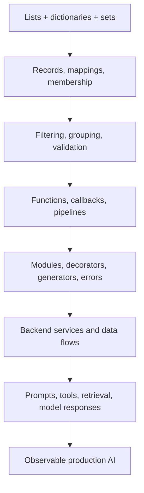

<p align="center"></p>

<p align="center">
  
  
  
  
</p>

<p align="center"><i>A living learning lab for building Python intuition, one small system at a time.</i></p>

---

## 📊 Journey Dashboard

<!--DASH:START-->
<p align="center"></p>

**Current checkpoint:** `Python foundations + mental-bridge applications`  
**Overall:** `█████████████░░░░░░░` **63%**

<details><summary>Plain-text view</summary>

```text
Python foundations    [██████████] 100%
Pythonic thinking     [██████████] 100%
Object-oriented code  [█████████░]  90%
Module library        [░░░░░░░░░░]   0%
Intermediate Python   [░░░░░░░░░░]   0%
Small applications    [██████████] 100%
Backend engineering   [██░░░░░░░░]  17%
ML fundamentals       [░░░░░░░░░░]   0%
LLM / RAG / agents    [░░░░░░░░░░]   0%
Production AI         [░░░░░░░░░░]   0%
```
</details>
<!--DASH:END-->

> Edit `journey.json`, push, and the dashboard, map, and book below rebuild automatically. See [How to update](#-how-to-update).

## 🗺️ Learning Map

<!--MAP:START-->

```mermaid
flowchart LR
    t0["🧱 Python foundations<br/>100%"]
    t1["🐍 Pythonic thinking<br/>100%"]
    t2["🧩 Object-oriented code<br/>90%"]
    t3["📚 Module library<br/>0%"]
    t4["🛠️ Intermediate Python<br/>0%"]
    t5["🚀 Small applications<br/>100%"]
    t6["🏗️ Backend engineering<br/>17%"]
    t7["📈 ML fundamentals<br/>0%"]
    t8["🤖 LLM / RAG / agents<br/>0%"]
    t9["🛡️ Production AI<br/>0%"]
    t0 --> t1 --> t2 --> t3 --> t4 --> t5 --> t6 --> t7 --> t8 --> t9
    classDef done fill:#bbf7d0,stroke:#166534,color:#052e16;
    classDef current fill:#fde68a,stroke:#92400e,color:#451a03,stroke-width:3px;
    classDef future fill:#e0f2fe,stroke:#075985,color:#082f49;
    class t0,t1,t5 done;
    class t2,t6 current;
    class t3,t4,t7,t8,t9 future;
```

🟢 complete · 🟡 in progress · 🔵 upcoming
<!--MAP:END-->

## 📖 The Book: Chapters, Topics, Subtopics

Every chapter lists what was covered, and where that idea shows up later in **AI or backend engineering**.

<!--BOOK:START-->
### Part 1 · 🧱 Python foundations — 100%

<details>
<summary><b>Chapter 1: Data, Logic &amp; Functions</b> &nbsp;·&nbsp; 7/7 topics</summary>

_Lessons 1 to 7: the raw material every program is made of._

| | Topic | Source | Subtopics covered | Future reference (AI / backend) |
| :-: | --- | --- | --- | --- |
| ✅ | **Strings** | [`1Strings.py`](1Strings.py) | slicing, f-strings, methods | Prompt templates and text cleaning for LLM inputs |
| ✅ | **Numeric data** | [`2NumericData.py`](2NumericData.py) | int/float, operators, conversion | Token counts, scores, and metrics |
| ✅ | **Lists, sets, tuples** | [`3List_Set_Tuple.py`](3List_Set_Tuple.py) | mutability, membership, ordering | Batches of documents, permission sets, immutable configs |
| ✅ | **Dictionaries** | [`4Dictonaries.py`](4Dictonaries.py) | lookup, nesting, iteration | JSON payloads and API records |
| ✅ | **Conditionals & booleans** | [`5Conditional_Boolean.py`](5Conditional_Boolean.py) | if/elif/else, truthiness | Request routing and guardrail checks |
| ✅ | **Loops & iterators** | [`6Loosps_Iterator.py`](6Loosps_Iterator.py) | for/while, iter/next | Streaming tokens and retry loops |
| ✅ | **Functions** | [`7Function.py`](7Function.py) | args/kwargs, return values, scope | Service handlers and agent tool functions |

</details>

### Part 2 · 🐍 Pythonic thinking — 100%

<details>
<summary><b>Chapter 2: Idiomatic Python</b> &nbsp;·&nbsp; 2/2 topics</summary>

_Writing less code that says more._

| | Topic | Source | Subtopics covered | Future reference (AI / backend) |
| :-: | --- | --- | --- | --- |
| ✅ | **Comprehensions** | [`9Comprehension.py`](9Comprehension.py) | list, dict, set | Fast data shaping in ETL and feature prep |
| ✅ | **Python mental models** | [`Python_Mental_Models.md`](Python_Mental_Models.md) | syntax to systems | Seeing backend and AI patterns in plain Python |

</details>

### Part 3 · 🧩 Object-oriented code — 90%

<details open>
<summary><b>Chapter 3: Classes &amp; Abstraction</b> &nbsp;·&nbsp; 4/5 topics</summary>

_Bundling data and behavior._

| | Topic | Source | Subtopics covered | Future reference (AI / backend) |
| :-: | --- | --- | --- | --- |
| ✅ | **Classes & instances** | [`10OOP.py`](10OOP.py) | __init__, class variables | Models, clients, and service objects |
| ✅ | **Class & static methods** | [`10OOP.py`](10OOP.py) | @classmethod, @staticmethod | Alternate constructors, e.g. Model.from_config() |
| ✅ | **Inheritance** | [`10OOP.py`](10OOP.py) | super(), overriding | Base provider classes for LLM vendors |
| ✅ | **Special methods & properties** | [`10OOP.py`](10OOP.py) | __repr__, @property | Validated fields, as in Pydantic |
| 🟡 | **Composition** | [`10OOP.py`](10OOP.py) | has-a vs is-a | Agents composed of tools, memory, and a model |

</details>

### Part 4 · 📚 Module library — 0%

<details>
<summary><b>Chapter 4: Module Library</b> &nbsp;·&nbsp; 0/0 topics</summary>

_Everything in 8Module_Library/, discovered automatically._

| | Topic | Source | Subtopics covered | Future reference (AI / backend) |
| :-: | --- | --- | --- | --- |

</details>

<details>
<summary><b>Chapter 5: Still to explore</b> &nbsp;·&nbsp; 0/1 topics</summary>

_Planned stdlib topics._

| | Topic | Source | Subtopics covered | Future reference (AI / backend) |
| :-: | --- | --- | --- | --- |
| ⬜ | **logging & typing** | — | — | Observability and typed API contracts |

</details>

### Part 5 · 🛠️ Intermediate Python — 0%

<details>
<summary><b>Chapter 6: Real-world Plumbing</b> &nbsp;·&nbsp; 0/0 topics</summary>

_Everything in intermediate/, discovered automatically._

| | Topic | Source | Subtopics covered | Future reference (AI / backend) |
| :-: | --- | --- | --- | --- |

</details>

<details>
<summary><b>Chapter 7: Still to explore</b> &nbsp;·&nbsp; 0/2 topics</summary>

_Planned next steps._

| | Topic | Source | Subtopics covered | Future reference (AI / backend) |
| :-: | --- | --- | --- | --- |
| ⬜ | **Validation** | — | — | Structured outputs from models |
| ⬜ | **Async basics** | — | — | Concurrent model and tool calls |

</details>

### Part 6 · 🚀 Small applications — 100%

<details>
<summary><b>Chapter 8: Mental-Bridge Applications</b> &nbsp;·&nbsp; 10/10 topics</summary>

_Ten scenarios that connect syntax to systems._

| | Topic | Source | Subtopics covered | Future reference (AI / backend) |
| :-: | --- | --- | --- | --- |
| ✅ | **01 Zip & dictionary mapping** | [`01_zip_dictionary_mapping.py`](Python_Application/01_zip_dictionary_mapping.py) | zip, filtering | Authorization and tool access |
| ✅ | **02 Set permissions** | [`02_set_permissions.py`](Python_Application/02_set_permissions.py) | set ops | Permission checks |
| ✅ | **03 Filter users** | [`03_filter_users.py`](Python_Application/03_filter_users.py) | predicates | Query-like selection / metadata retrieval |
| ✅ | **04 Transform API data** | [`04_transform_api_data.py`](Python_Application/04_transform_api_data.py) | map | API response shaping |
| ✅ | **05 Group users by role** | [`05_group_users_by_role.py`](Python_Application/05_group_users_by_role.py) | grouping | Aggregation and reporting |
| ✅ | **06 JSON data processing** | [`06_json_data_processing.py`](Python_Application/06_json_data_processing.py) | json | External data boundaries |
| ✅ | **07 Function as data** | [`07_function_as_data.py`](Python_Application/07_function_as_data.py) | callbacks | Pluggable model/tool strategies |
| ✅ | **08 Decorator logging** | [`08_decorator_logging.py`](Python_Application/08_decorator_logging.py) | decorators | Tracing and observability |
| ✅ | **09 Generator data** | [`09_generator_large_data.py`](Python_Application/09_generator_large_data.py) | yield | Streaming and memory efficiency |
| ✅ | **10 Error-handling pipeline** | [`10_error_handling_pipeline.py`](Python_Application/10_error_handling_pipeline.py) | try/except | Resilient processing |

</details>

### Part 7 · 🏗️ Backend engineering — 17%

<details open>
<summary><b>Chapter 9: Services &amp; Data</b> &nbsp;·&nbsp; 0/3 topics</summary>

_Turning scripts into services._

| | Topic | Source | Subtopics covered | Future reference (AI / backend) |
| :-: | --- | --- | --- | --- |
| 🟡 | **Patterns connected** | — | handlers, pipelines | FastAPI services |
| ⬜ | **REST with FastAPI** | — | — | Serving models |
| ⬜ | **Databases** | — | — | Vector stores and metadata |

</details>

### Part 8 · 📈 ML fundamentals — 0%

<details>
<summary><b>Chapter 10: Learning from Data</b> &nbsp;·&nbsp; 0/2 topics</summary>

_The next frontier._

| | Topic | Source | Subtopics covered | Future reference (AI / backend) |
| :-: | --- | --- | --- | --- |
| ⬜ | **NumPy & pandas** | — | — | Embeddings and datasets |
| ⬜ | **Model basics** | — | — | Evaluation mindset |

</details>

### Part 9 · 🤖 LLM / RAG / agents — 0%

<details>
<summary><b>Chapter 11: AI Systems</b> &nbsp;·&nbsp; 0/3 topics</summary>

_Prompts, retrieval, tools._

| | Topic | Source | Subtopics covered | Future reference (AI / backend) |
| :-: | --- | --- | --- | --- |
| ⬜ | **LLM APIs & structured output** | — | — | — |
| ⬜ | **RAG** | — | — | — |
| ⬜ | **Agents & tool use** | — | — | — |

</details>

### Part 10 · 🛡️ Production AI — 0%

<details>
<summary><b>Chapter 12: Shipping Safely</b> &nbsp;·&nbsp; 0/3 topics</summary>

_Testing, observability, deployment._

| | Topic | Source | Subtopics covered | Future reference (AI / backend) |
| :-: | --- | --- | --- | --- |
| ⬜ | **Testing** | — | — | — |
| ⬜ | **Observability** | — | — | — |
| ⬜ | **Deployment** | — | — | — |

</details>

<!--BOOK:END-->

## 🧪 Projects and the Concepts They Use

<!--PROJECTS:START-->
_No projects yet. Add one to `journey.json` under `projects` and this table fills itself in._
<!--PROJECTS:END-->

## 🧠 The Core Mental Model


```mermaid
flowchart TD
    A[Lists + dictionaries + sets] --> B[Records, mappings, membership]
    B --> C[Filtering, grouping, validation]
    C --> D[Functions, callbacks, pipelines]
    D --> E[Modules, decorators, generators, errors]
    E --> F[Backend services and data flows]
    F --> G[Prompts, tools, retrieval, model responses]
    G --> H[Observable production AI]
```

| Python idea | Becomes |
| --- | --- |
| Dictionary mapping | Authorization |
| Filter | Metadata retrieval |
| Generator | Streaming |
| Decorator | Logging / tracing |
| Exception handler | Resilient processing |
| Function passed as data | Model or tool strategy |

## 🧭 Repository Guide

- [Python mental models](Python_Mental_Models.md): the ideas behind the progression
- [Mental model map](Python_Application/Python_Mental_Model_Map.md): syntax to systems
- [Core lessons](.): `1Strings.py` to `10OOP.py`, plus `8Module_Library/` and `intermediate/`
- [Application exercises](Python_Application): scenario-driven practice modules

```bash
python Python_Application/01_zip_dictionary_mapping.py
```

## 🔄 How to update

1. Change a topic's `status` in `journey.json` to `done`, `wip`, or `todo` (`wip` counts as half).
2. Add subtopics and the `future` reference as you learn them.
3. Add a project under `projects`:
   ```json
   {"name": "Tool router", "link": "https://github.com/you/tool-router", "status": "building",
    "concepts": ["Inheritance", "10 Error-handling pipeline"]}
   ```
   `concepts` must match topic names; each resolves to its chapter automatically.
4. Run `python scripts/build_readme.py` locally, or just push: the GitHub Action does it for you.

## ⭐ North Star

```text
Learn a concept. Use it in a realistic problem.
Recognize the larger system it belongs to. Build the next layer.
```
